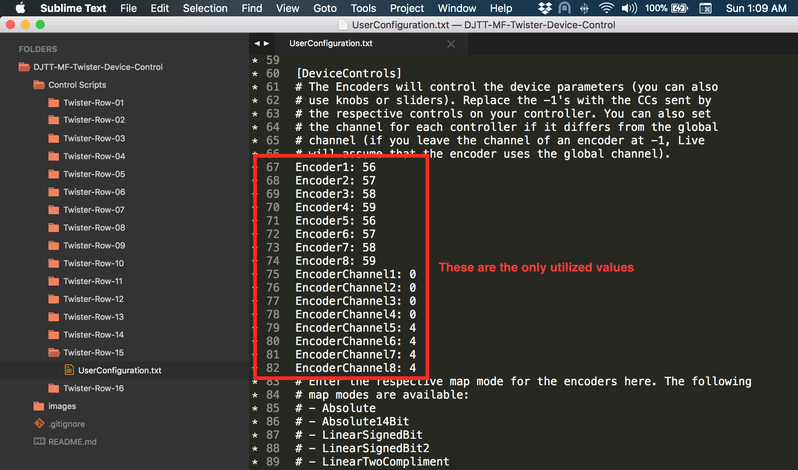
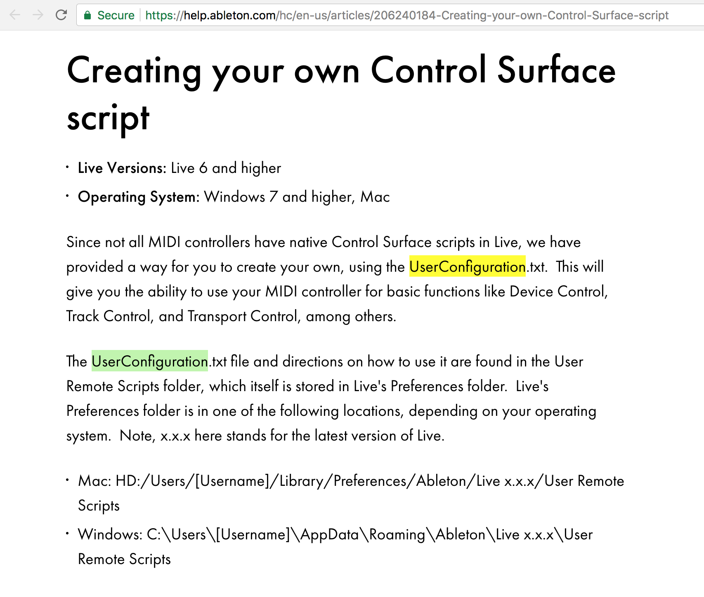

DJ Tech Tools - Midi Fighter Twister
--

Adds blue hand functionality for up to 6 Live devices.

Supported since Live 6 (Live 10+). No more manually mapping knobs!

Intended for use with Twister's innovative 'shift encoder' functionality

1. Determine hardware rows to dedicate for device control
2. Using Midi Fighter Utility, assign Shift Encoder (Hold) for each row
3. Open Live preferences, choose corresponding row's Control Script

**Rows should now be tracking the focused device. At any time, right click and lock device to row**

