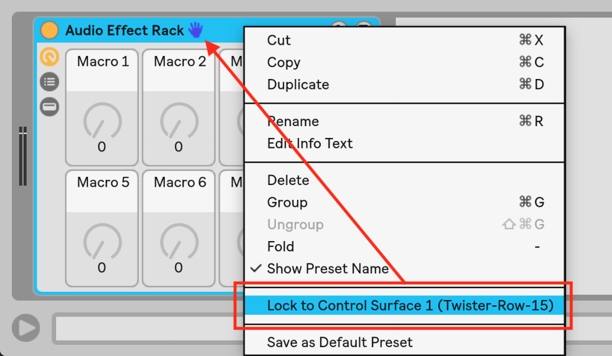
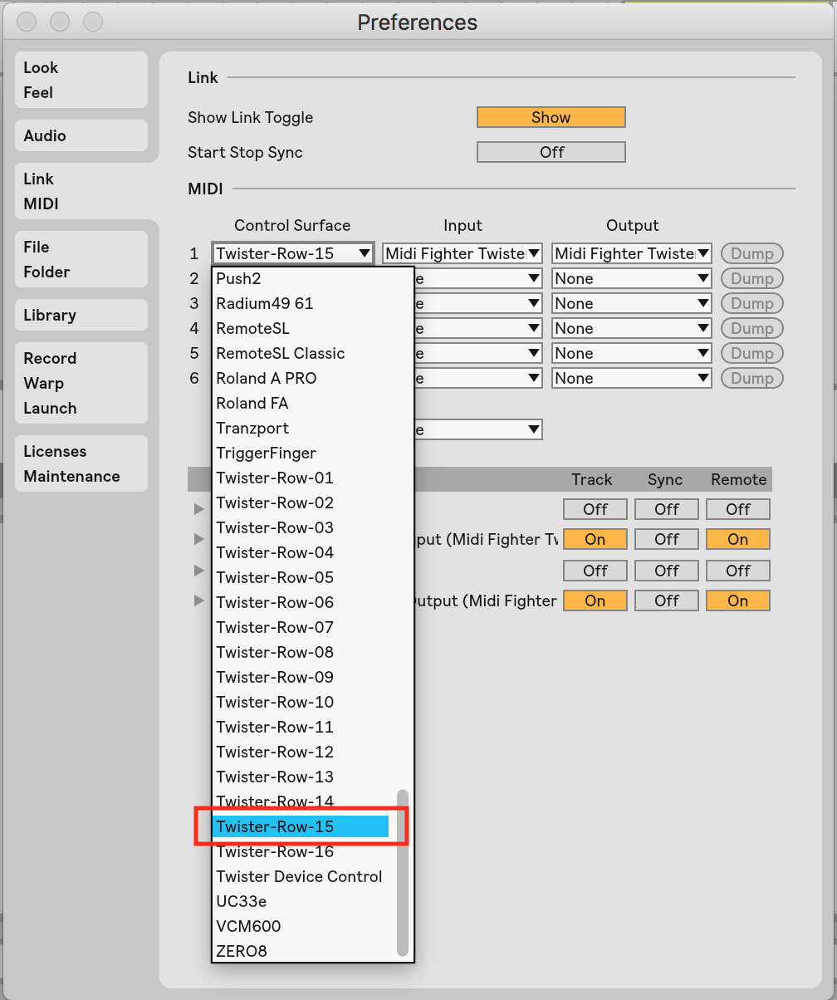
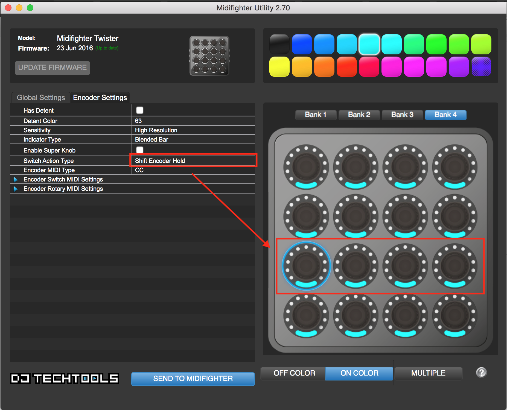

DJ Tech Tools (DJTT) Midi Fighter Twister

Adds lockable blue hand functionality for all rows, using push turn to control knobs 5, 6, 7, 8

---

Supported since Live 6 (Live 10+).

Utilizes 16 UserConfiguration.txt files, see default example in following locations:

    Mac: HD:/Users/[Username]/Library/Preferences/Ableton/Live x.x.x/User Remote Scripts
    Windows: C:\Users\[Username]\AppData\Roaming\Ableton\Live x.x.x\User Remote Scripts

https://help.ableton.com/hc/en-us/articles/206240184-Creating-your-own-Control-Surface-script

Change folder names to rename the control scripts.

---

